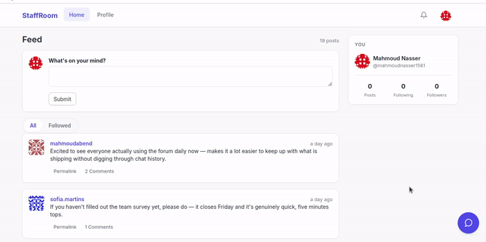

# StaffRoom


<p align="center">
  
</p>

*Feed and posting, comments and notifications, follow/unfollow, AI
content moderation, and the policy chatbot, all recorded from a
running local instance rather than staged.*

StaffRoom is a full-stack internal forum for teams, built with Flask:
a private space for coworkers to post updates, comment, and keep up
with what teammates are working on. Built and iterated on over roughly
18 months (March 2025 – September 2026), it started as a
demonstration of core Flask fundamentals (auth, roles, database
migrations, pagination) and grew into a production-shaped app: a
role-based permission system, a versioned JSON API, Redis-backed rate
limiting and caching, "Sign in with Google," and two optional AI
services built on Amazon Bedrock (content moderation and a
policy-answering chatbot), all containerized, all covered by an
automated test suite, all running in CI on every push.

## Features

**Core forum**
- Markdown posts and comments (Flask-PageDown, live preview client-side,
  server-side rendering via `markdown` + `bleach` HTML sanitization)
- Follow/unfollow other users, with a personal "followed only" feed
- User profiles: bio, location, member-since/last-seen timestamps,
  Gravatar avatars
- Paginated feeds, comment threads, and follower/following lists
- Post cards are fully clickable (not just a small "Permalink" link):
  click anywhere on a post to open its comment thread, while the
  author link, moderation actions, and any links inside the post's own
  text keep working independently

**Accounts, roles, and moderation**
- Email/password auth (Flask-Login) plus "Sign in with Google"
  (Authlib/OAuth2), with automatic account linking by email
- Three built-in roles (`User`, `Moderator`, `Administrator`) backed by
  a bitmask permission system (`FOLLOW`, `COMMENT`, `WRITE`,
  `MODERATE`, `ADMIN`), not a hardcoded `is_admin` flag
- Moderators can disable/enable individual posts or comments; authors
  can only edit their own content. Admins were deliberately *not*
  given a bypass to rewrite other people's posts, enforced identically
  in the web app and the API
- A single `moderation_flags` audit table records every disable/enable,
  whether triggered by a human moderator or the AI service, including
  who did it and whether it was later reversed
- Email confirmation, password reset, and email-change flows, all
  sent asynchronously so the request thread never blocks on SMTP

**Notifications & API**
- In-app notification bell when someone comments on your post (schema
  designed with a generic `verb` + nullable post/comment references,
  so new notification types don't need a migration); also exposed via
  the API, with unread notifications marked read as they're fetched
- A versioned, token-authenticated JSON API (`/api/v1/`) with
  HATEOAS-style pagination links throughout, complete enough to drive
  a native mobile client for every core in-app action: posting,
  commenting, following/unfollowing, followers/following lists,
  profile editing, password/email changes, notifications, and
  moderator disable/enable. (Account creation and Google sign-in are
  still web-only.)

**AI-assisted content moderation (optional)**
- A standalone service reviews new posts/comments against a written
  policy via a model on Amazon Bedrock and disables anything that
  violates it: its own Docker service, its own least-privilege IAM
  policy, and a shared audit trail with human moderator actions, fully
  decoupled so publishing never waits on it and nothing breaks if it's
  absent (see [AI content moderation](#ai-content-moderation-optional)
  below and [Engineering highlights](#engineering-highlights))

**AI policy chatbot (optional)**
- A second standalone Bedrock-backed service: a chat widget, open to
  any visitor whether logged in or not, that answers questions about
  the platform's rules of use, grounded in the exact same policy
  document the moderation service enforces. It has no tool-calling
  ability at all (pure text generation) and never discusses anything
  account-specific (see [Policy chatbot](#policy-chatbot-optional)
  below)

**Design**
- A consistent, hand-built design-token system (Jinja2 templates +
  vanilla CSS, no frontend framework or build step) applied across
  every page: navbar, feed, profiles, forms, auth pages, moderation
  queue, and error states all share one visual language and
  component set

**Infrastructure & reliability**
- Docker Compose stack (`db`, `redis`, `web`, optional
  `moderation-agent`), health-checked and ready to use with one command
- Redis-backed rate limiting and response caching, correct across
  gunicorn's multiple worker processes, not per-worker
- Database migrations via Flask-Migrate/Alembic
- Automated test suite (`flask test`, coverage support built in) run
  on every push and PR via GitHub Actions

## Tech stack

**Backend:** Flask 3, Flask-SQLAlchemy, Flask-Migrate (Alembic),
Flask-Login, Flask-WTF, Flask-Mail, Flask-Bootstrap, Flask-PageDown,
Flask-Limiter, Flask-Caching, Flask-HTTPAuth, Authlib (Google OAuth)
**Data:** PostgreSQL, Redis
**AI services:** boto3 (Amazon Bedrock Runtime), two standalone
Python services (content moderation, policy chatbot), each with its
own Dockerfile and dependency set
**Infra:** Docker / Docker Compose, gunicorn, GitHub Actions CI
**Testing:** Python `unittest`, 71 tests, run in CI on every push/PR

## Engineering highlights

A few decisions worth calling out specifically, since "it works" is a
lower bar than "it's built to fail safely":

- **The AI moderation pipeline can never slow down or break publishing.**
  Posting a comment does one fast, local, best-effort Redis push and
  returns; it never waits on the moderation service or on Bedrock. If
  that service is down or was never started, the app detects this via
  a heartbeat key and skips the push entirely (one calm log line, no
  error), so no backlog ever builds up waiting for a consumer that
  isn't there.
- **Moderation decisions are hash-checked against staleness, twice.**
  Every job carries a hash of the content at the moment it was queued.
  Before spending a Bedrock call, and again right before disabling
  anything, the app recomputes the content's *current* hash and
  compares it, so content edited or deleted between being queued and
  being reviewed is never acted on based on a stale snapshot.
- **The AI's permissions are constrained structurally, not just by
  prompt wording.** The model is given exactly one callable tool per
  review (flag this content, with a reason), and the schema never
  includes an id parameter; the id is supplied by the agent's own code,
  which already knows it from the job. The model literally cannot name
  a different target, which closes off a whole class of prompt
  injection where reviewed content tries to redirect the action
  elsewhere.
- **One audit trail, regardless of who or what moderated something.**
  Human moderator actions and AI actions both write to the same
  `moderation_flags` table: source, reason, moderator/AI attribution,
  and whether it was later overturned. It's already shaped to support
  a future automated-enforcement feature (e.g. flag accounts with
  repeated violations) without another migration.
- **Least-privilege AWS access.** The moderation service's IAM policy
  grants exactly `bedrock:InvokeModel`/`bedrock:Converse` on one
  specific model ARN, not the broad `AmazonBedrockFullAccess` managed
  policy.
- **Internal service auth is HMAC-SHA256 request signing, not a shared
  token.** Both AI services authenticate with `web` this way rather
  than mTLS, JWT, or AWS SigV4/IAM: it's a genuine security upgrade
  (the secret never travels on the wire, requests can't be replayed or
  tampered with) that needs zero new infrastructure and zero changes
  to how the project is set up, unlike the heavier options, which
  would work against the "clone it and it runs in minutes" goal for a
  system this size.

## Getting Started

1. Create a virtual environment and install dependencies:
   ```
   python -m venv venv
   source venv/bin/activate
   pip install -r requirements/dev.txt
   ```
2. Set the required environment variables (e.g. in a `.env` file):
   ```
   FLASK_APP=app.py
   SECRET_KEY=<your-secret-key>
   FLASKY_ADMIN=<your-admin-email>
   ```
3. Run the deployment task to create the database schema and seed the
   default user roles. This step is required before the app can be used,
   otherwise newly registered users won't have a role or any permissions:
   ```
   flask deploy
   ```
4. Start the app:
   ```
   flask run
   ```

## Run with Docker

1. Copy `.env.example` to `.env` and fill in your own values (at minimum
   `SECRET_KEY`; fill in the `MAIL_*` fields too if you want confirmation
   emails to actually send; see the comments in `.env.example` for how to
   get a Gmail App Password). `.env` is git-ignored, so your real values
   never get committed.
2. Run:
   ```
   docker compose up --build
   ```
   Then open http://localhost:5000 in your browser. The `web` container
   runs `flask deploy` (migrations + role seeding) automatically before
   starting, so it's ready to use as soon as the containers are up.

Data persists in a named volume across restarts; use
`docker compose down -v` to also remove the database volume.

A `GET /health` endpoint checks database connectivity and returns
`{"status": "ok"}` (200) or `{"status": "error"}` (503); `docker compose
ps` reflects this via the `web` service's health status.

### Seed demo data (optional)

The app starts empty: no fake users, posts, or comments are created
automatically. To populate it with demo content so the site looks live
when you browse it, run this once after the stack is up:
```
docker compose exec web flask seed
```
This creates 50 fake users, 100 posts, follow relationships between
users, and 200 comments. To customize the amounts:
```
docker compose exec web flask seed --users 20 --posts 50 --comments 80
```
Re-running `flask seed` is safe for users and follows (duplicates are
skipped), but will add *more* posts and comments each time rather than
replacing them.

## Testing

```
flask test
```
runs the full `unittest` suite, 71 tests covering models, API, auth
flows, notifications, moderation routes, the chatbot's public
endpoints, and the HMAC request-signing logic. Add `--coverage` to
also generate a coverage report:
```
flask test --coverage
```
The same suite runs automatically on every push and pull request via
GitHub Actions (see the badge at the top of this file).

## Security

Login (`/auth/login`) and registration (`/auth/register`) are rate
limited per IP address (10 login attempts/minute, 5 registrations/hour;
only `POST` submissions count, so browsing the pages freely never trips
it) to slow down password-guessing and mass account creation. The API's
token-issuing endpoint (`POST /api/v1/tokens/`) carries the same
10/minute limit, since it's just as viable a target for credential
stuffing as the web login form. The limiter is backed by Redis (the
`redis` service in `docker-compose.yml`) so the
limit is enforced correctly across gunicorn's multiple worker processes;
without a shared backend, each worker would track its own count and the
real limit would silently be higher than configured. Set `REDIS_URL` to
point elsewhere in production; running `flask run` locally without Redis
falls back to in-memory storage automatically (fine for a single dev
process).

`GET /api/v1/posts/`, `GET /api/v1/posts/<id>`, and `GET /api/v1/users/<id>`
are cached for 60 seconds (also Redis-backed, same fallback behavior as
above) to reduce DB load on repeated reads. A change made within that
window (e.g. a new post) can take up to 60s to show up in these three
endpoints. Write endpoints are never cached.

Both AI services' AWS credentials follow the same least-privilege
principle, and are by design the exact same credentials (see
[Policy chatbot](#policy-chatbot-optional) below). See
[AI content moderation](#ai-content-moderation-optional) below for the
exact IAM policy used.

Both AI services authenticate with `web` (in either direction) using
HMAC-SHA256 request signing rather than a plain shared token. A
timestamp is part of what gets signed and checked against a 60-second
window, so a captured request can't be replayed later, and the
signing secret itself never travels over the wire.

## Sign in with Google

In addition to the normal email/password login, users can sign in or
sign up with a Google account. If a Google sign-in's email matches an
existing password-based account, the Google identity is linked to it
(the password keeps working); otherwise a new account is created.

**Setup:**

1. Go to the [Google Cloud Console](https://console.cloud.google.com/)
   and create a new project (or select an existing one).
2. Under **APIs & Services → OAuth consent screen**, configure the
   consent screen: choose **External** (unless you have a Google
   Workspace org and want **Internal**), fill in an app name and
   support email, and add the `openid`, `email`, and `profile` scopes
   (these are exactly what this app requests, nothing more).
3. Under **APIs & Services → Credentials**, click **Create Credentials
   → OAuth client ID**, choose **Web application**, and add an
   **Authorized redirect URI** of:
   ```
   http://localhost:5000/auth/google/callback
   ```
   (substitute your real domain in production; this must match
   exactly, including the scheme).
4. Copy the generated **Client ID** and **Client secret** into `.env`:
   ```
   GOOGLE_CLIENT_ID=<your-client-id>
   GOOGLE_CLIENT_SECRET=<your-client-secret>
   ```
5. Restart the app (`docker compose up -d --build web` or restart
   `flask run`) so the new environment variables are picked up.
6. Test it: go to `/auth/login` and click "Sign in with Google"; you
   should be redirected to Google, then back to the app, signed in.

## AI content moderation (optional)

A standalone service reviews new posts/comments via a model on Amazon
Bedrock (**Nova Micro**, chosen specifically for cost: roughly
$0.035/$0.14 per million input/output tokens, well under $0.001 per
classification at this app's prompt size) and disables anything that
violates the policy defined in
[`moderation_agent/policy.md`](moderation_agent/policy.md): six
categories (harassment, hate speech, sexual content, promotion of
illegal activity, spam/scam links, dangerous misinformation), each
with worked "flag this / don't flag this" examples so the model has
concrete boundaries, not just abstract rules.

It's fully decoupled from the main app: publishing stays exactly as
fast whether this service is running or not, and if it's down or
absent, nothing breaks; content just isn't reviewed until it's back.
Internally, publishing does a best-effort push onto a Redis queue only
if the agent's heartbeat key is present (so nothing ever queues up
for a consumer that isn't there); the agent does a cheap read-only
`verify` call before spending a Bedrock call, and the actual `disable`
call re-checks existence and content hash again independently before
mutating anything, so an edited or deleted post is never acted on
based on a stale snapshot. See
[Engineering highlights](#engineering-highlights) above for the rest
of the design decisions (the disable-only tool schema, the shared
audit trail, the least-privilege IAM policy).

**Setup:**

1. **Create (or reuse) an IAM user or role** you can generate access
   keys for. No Bedrock-specific account setup is needed beyond this:
   AWS retired the old "Model access" console step; serverless models
   like Nova Micro auto-enable on an account the first time they're
   actually invoked.
2. **Grant it least-privilege Bedrock access**: exactly
   `InvokeModel`/`Converse` (and their streaming variants) on the one
   model this app uses, nothing account-wide. Either via the AWS CLI:
   ```bash
   cat > bedrock-policy.json <<'EOF'
   {
     "Version": "2012-10-17",
     "Statement": [
       {
         "Sid": "StaffRoomModerationNovaMicroInvoke",
         "Effect": "Allow",
         "Action": [
           "bedrock:InvokeModel",
           "bedrock:InvokeModelWithResponseStream",
           "bedrock:Converse",
           "bedrock:ConverseStream"
         ],
         "Resource": "arn:aws:bedrock:us-east-1::foundation-model/amazon.nova-micro-v1:0"
       }
     ]
   }
   EOF
   aws iam put-user-policy \
     --user-name <your-iam-user> \
     --policy-name StaffRoomBedrockModerationAccess \
     --policy-document file://bedrock-policy.json
   ```
   or via the console: **IAM → Users → (your user) → Add permissions →
   Create inline policy → JSON tab**, paste the same document, and
   name it.
3. **Get an access key** for that user (`aws iam create-access-key
   --user-name <your-iam-user>`, or **IAM console → your user →
   Security credentials → Create access key**).
4. **Add to `.env`**:
   ```
   MODERATION_SERVICE_TOKEN=<generate with: python3 -c "import secrets; print(secrets.token_hex(32))">
   AWS_ACCESS_KEY_ID=<your-access-key-id>
   AWS_SECRET_ACCESS_KEY=<your-secret-access-key>
   AWS_REGION=us-east-1
   ```
   (change `AWS_REGION` and the resource ARN's region in step 2
   together if you use a different region).
5. **Start it**: this is a separate opt-in service, so it needs its
   own flag:
   ```
   docker compose --profile moderation up -d --build
   ```
   Plain `docker compose up` (no profile) never starts it.
6. **Verify it's working**: post something on the site, then check
   ```
   docker compose logs moderation-agent
   ```
   for a `not flagged` or `disabled: <reason>` line within a few
   seconds. Posting something that clearly matches one of
   `policy.md`'s categories should get disabled automatically, with
   the reason visible both in the logs and in an email to
   `FLASKY_ADMIN`.

## Policy chatbot (optional)

A second standalone Bedrock-backed service: a floating chat widget,
visible to any visitor whether they're logged in or not, that answers
questions about StaffRoom's rules of use. It's grounded in the exact
same [`moderation_agent/policy.md`](moderation_agent/policy.md) the
moderation service enforces, copied into its container via a read-only
volume mount rather than duplicated, so the two AI features can never
drift apart on what the rules actually are.

Unlike moderation, which is deliberately asynchronous so publishing
never waits on it, a chat reply is exactly what a visitor is waiting
for, so this service is a synchronous request/response call instead
of a queue. The model is given no tools at all (pure text generation,
nothing it can act on) and never sees or discusses anything
account-specific, only general policy questions. The widget checks a
`/chat/status` endpoint the moment it opens; if the service isn't
running, it shows a plain "not available" state with a Refresh button
instead of a broken chat window, and drops back to that same state if
the service ever goes down mid-conversation.

**Setup:**

If you've already set up [AI content moderation](#ai-content-moderation-optional)
above, this needs **no additional AWS work at all**: it reuses the
exact same `AWS_ACCESS_KEY_ID`/`AWS_SECRET_ACCESS_KEY`/`AWS_REGION`
already in `.env`. Otherwise, follow steps 1-3 above first, then:

1. **Add to `.env`**:
   ```
   CHATBOT_SERVICE_TOKEN=<generate with: python3 -c "import secrets; print(secrets.token_hex(32))">
   ```
   (`CHATBOT_MODEL_ID` defaults to `amazon.nova-micro-v1:0`, same as
   moderation, only set it if you want a different model.)
2. **Start it**: a separate opt-in service, its own profile flag:
   ```
   docker compose --profile chatbot up -d --build
   ```
   Plain `docker compose up` (no profile) never starts it.
3. **Verify it's working**: open the site, click the chat launcher
   (bottom-right corner), and ask a question about StaffRoom's rules;
   you should get a grounded answer within a few seconds. If the
   widget shows "not available," check
   ```
   docker compose logs chatbot-service
   ```
